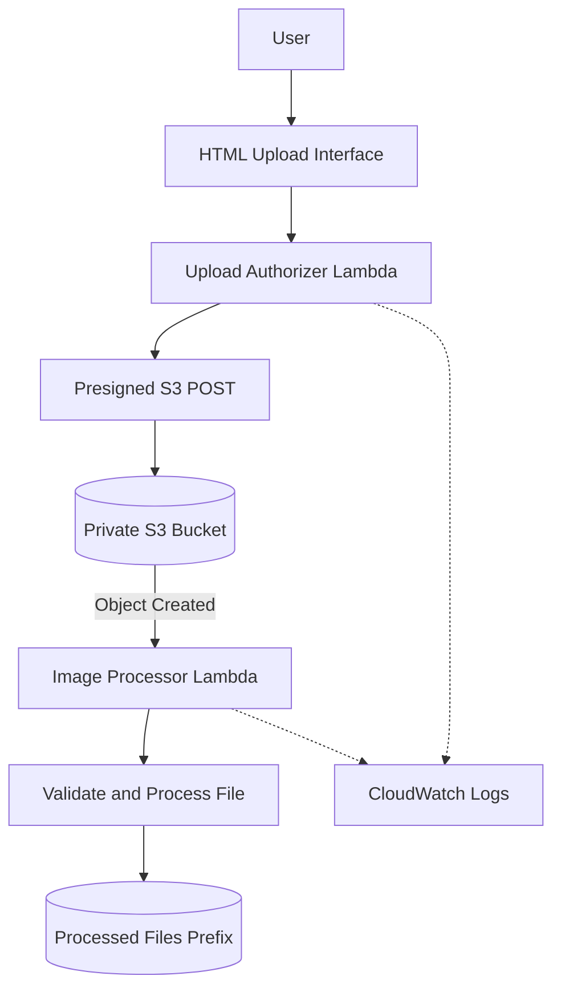

# AWS Student Verification System

A serverless document upload and image-processing application built using **AWS S3, AWS Lambda, Python, and IAM**.

<p align="center">
  
  
  
  
</p>

## Overview

The **AWS Student Verification System** is a cloud-based document upload and processing project designed to demonstrate secure file handling, serverless computing, and automated document processing on AWS.

Users can select a document through a web interface, submit a demo access code, and upload the file to a private Amazon S3 bucket. AWS Lambda processes supported files and stores the resulting output in a separate S3 prefix.

The project demonstrates practical implementation of cloud storage, event-driven processing, IAM permissions, and operational monitoring.

> **Note:** This project demonstrates document upload and processing. It does not perform identity verification, OCR-based identity extraction, or fraud detection.

## Key Features

- **Serverless architecture** using AWS Lambda.
- **Private cloud storage** with Amazon S3.
- **Presigned uploads** to support direct browser-to-S3 file transfer.
- **Document processing** for supported image formats and PDF files.
- **Automated processing** triggered by S3 object-creation events.
- **IAM-based access control** with dedicated Lambda execution roles.
- **CloudWatch logging** for monitoring and troubleshooting.
- **File size and format checks** to limit unsupported uploads.

## Architecture



## AWS Services and Technologies

| Technology | Purpose |
|---|---|
| Amazon S3 | Private storage for uploaded and processed files |
| AWS Lambda | Serverless authorization and document processing |
| AWS IAM | Permissions and access control for Lambda functions |
| Amazon CloudWatch | Logs, monitoring, and troubleshooting |
| Python 3.12 | Backend processing and upload authorization |
| HTML, CSS, JavaScript | Browser-based upload interface |
| Pillow | Image resizing and image processing |
| AWS Lambda Function URL | HTTP endpoint for the upload authorizer |

## Project Workflow

1. The user opens the web-based upload interface.
2. The interface submits file details and a demo access code to the upload authorizer.
3. The authorizer validates the request and generates a short-lived presigned S3 POST.
4. The browser uploads the file directly to the private S3 bucket.
5. An S3 object-creation event invokes the image processor Lambda function.
6. The processor validates and processes supported files.
7. The processed output is stored separately in the `processed/` prefix.
8. CloudWatch captures execution logs for debugging and monitoring.

## Repository Structure

```text
AWS-Student-Verification/
├── README.md
├── frontend/
│   └── index.html
├── lambda/
│   ├── upload_authorizer/
│   │   └── lambda_function.py
│   └── image_processor/
│       └── lambda_function.py
├── docs/
│   ├── architecture.md
│   ├── aws-deployment.md
│   └── security-and-cost.md
├── .gitignore
└── LICENSE
```

## Supported Files

The processing workflow is designed for:

- **Images:** JPG, JPEG, and PNG
- **Documents:** PDF

The current configuration limits uploads to 5 MiB. Image processing resizes images to a maximum dimension of 1600 × 1600 pixels, while PDFs are checked for a PDF signature before being copied to the processed location.

These checks provide basic file handling and validation; they do not guarantee that uploaded files are safe or authentic.

## Security Considerations

- Amazon S3 Block Public Access remains enabled.
- Uploaded and processed files are stored in separate prefixes.
- Lambda functions use dedicated IAM execution roles.
- Presigned upload requests are short-lived.
- CloudWatch log retention is configured to limit log storage duration.
- Demo credentials and AWS account secrets must not be committed to GitHub.
- Only synthetic, non-sensitive test documents should be used.

**Important:** The demo access-code mechanism is not a production-grade authentication system. This project should not be used to collect real student identity documents without appropriate authentication, authorization, encryption, retention controls, and security review.

## Setup and Deployment

Deployment and configuration instructions will be maintained in the [`docs/`](docs/) directory.

Before deploying, review the Lambda environment variables, S3 bucket configuration, IAM policies, event notifications, and frontend endpoint settings.

The source code committed to this repository should be compared against the currently deployed AWS functions and tested before use.

## Learning Outcomes

This project provides practical experience with:

- Designing a serverless AWS workflow.
- Configuring Amazon S3 and event notifications.
- Building Python-based AWS Lambda functions.
- Applying least-privilege IAM permissions and understood about roles.
- Handling presigned uploads from a web application.
- Processing files using Python and Pillow.
- Monitoring application execution through CloudWatch.
- Documenting security considerations and cloud architecture.
- Set up budgeting and monitoring of cost.

## Future Improvements

- Replace demo access-code authentication with a stronger identity and authorization mechanism.
- Add automated tests and input-validation test cases.
- Add infrastructure as code using AWS SAM or AWS CloudFormation.
- Improve monitoring, error handling, and processing status reporting.
- Add CI checks for code quality and configuration errors.

## Author

**Anish Dorke**  
B.Tech Computer Engineering | Bharati Vidyapeeth (Deemed to be University), College of Engineering, Pune

GitHub: [@AnishDorke](https://github.com/AnishDorke)
LinkedIn: [@AnishDorke](https://www.linkedin.com/in/anish-dorke-871579367)

---

*Built as a cloud computing and serverless application project to understand integrating cloud services and workflows to build an enterprise system.*
