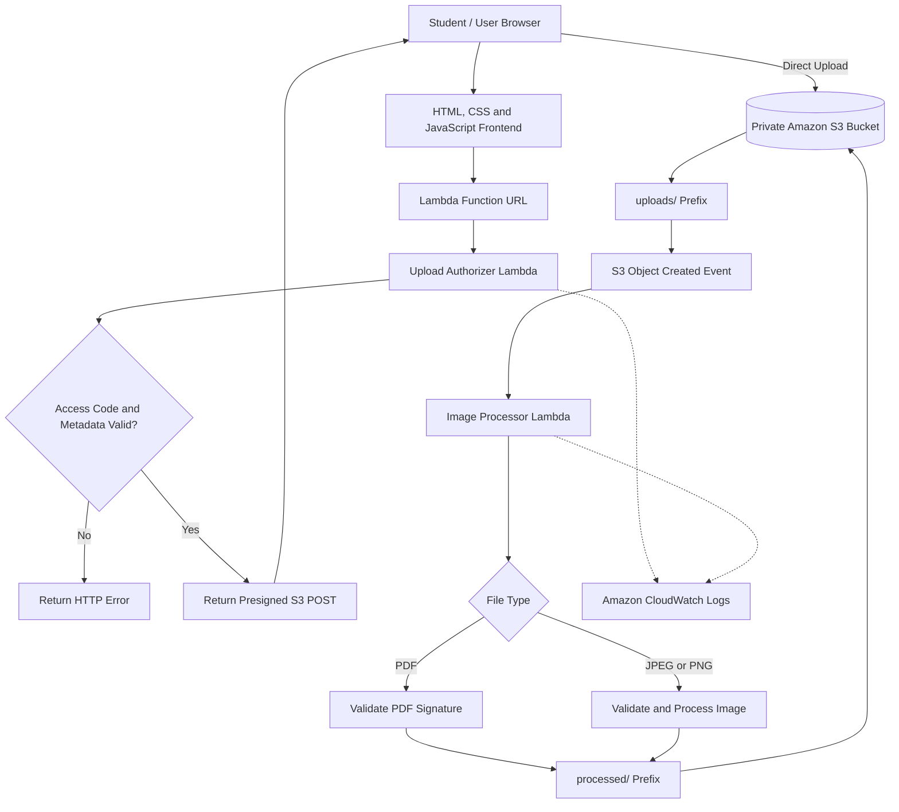

# System Architecture and Technical Specification

## 1. Overview

The **Student Document Upload and Image Processing System** is a serverless application built on Amazon Web Services (AWS). It demonstrates secure document ingestion, application-level upload validation, event-driven file processing, and private cloud storage.

The application uses an HTML, CSS, and JavaScript frontend, AWS Lambda for request authorization and file processing, Amazon S3 for document storage, AWS Identity and Access Management (IAM) for permissions, and Amazon CloudWatch for execution logs.

The system supports PDF, JPEG, and PNG uploads. Images are resized when necessary and converted to PNG, while PDF documents undergo a basic file-signature check before being copied to the processed storage location.

The project is intended for educational and demonstration purposes. It does not perform identity verification, OCR, fraud detection, or verification against institutional records.

## 2. Architecture Diagram



**Architecture note:** The frontend is currently documented as a client-side application. Public hosting through Amazon CloudFront or a separate frontend S3 bucket is not included because those components have not been established as part of the verified deployment.

## 3. AWS Services and Components

| Service or Component           | Responsibility                                                                    |
| ------------------------------ | --------------------------------------------------------------------------------- |
| Amazon S3                      | Stores uploaded and processed documents in separate prefixes                      |
| AWS Lambda – Upload Authorizer | Validates the demo access code and file metadata, then generates a presigned POST |
| Lambda Function URL            | Provides an HTTPS endpoint for upload authorization                               |
| AWS Lambda – Image Processor   | Validates uploaded files, resizes supported images, and stores processed outputs  |
| Amazon CloudWatch Logs         | Records execution details and errors                                              |
| AWS IAM                        | Defines permissions for Lambda execution and S3 access                            |
| S3 Event Notifications         | Invoke the image-processing Lambda when an object is created under `uploads/`     |

The deployed Lambda functions use Python 3.12. The image-processing function uses a Pillow layer for image manipulation.

## 4. System Workflow

### Step 1: Document Selection

The user opens the frontend and selects a PDF, JPEG, or PNG document. The frontend collects the required file metadata and the demonstration access code.

The public repository frontend uses a placeholder for the authorizer endpoint. It must be configured with the appropriate endpoint before the frontend can communicate with the deployed Lambda function.

### Step 2: Upload Authorization

The browser sends the upload request to the Upload Authorizer Lambda through its Function URL.

The authorizer checks:

* The supplied demonstration access code against the configured environment variable.
* The filename and file extension.
* The permitted file type and corresponding MIME type.
* The application-level maximum file size of 5 MiB.

If validation succeeds, the function returns a presigned S3 POST with an expiration of approximately 60 seconds. Invalid requests receive an error response.

**Important:** The Function URL is configured with authentication type `NONE`, so the application-level access-code check is not equivalent to AWS IAM authentication or a full identity-management system.

### Step 3: Direct Upload to Amazon S3

The browser uses the returned presigned POST to upload the document directly to the private S3 bucket:

`college-id-verification-anish-2026`

The original document is stored under the `uploads/` prefix. This approach avoids sending the complete file through the authorization Lambda.

The presigned POST is short-lived. Actual browser upload success also depends on the configured S3 permissions, request fields, and CORS settings.

### Step 4: Event-Driven Processing

An S3 object-created event for the `uploads/` prefix invokes the Image Processor Lambda.

The processor checks the object key, file extension, and file size before processing the file.

#### PDF Processing

* Checks that the file begins with the expected `%PDF-` signature.
* Copies the file to the `processed/` prefix.
* Assigns a unique output filename.
* Stores the output with the `application/pdf` content type and server-side encryption.

This is a basic signature check, not comprehensive PDF validation, sanitization, or malware scanning.

#### Image Processing

* Uses Pillow to inspect and validate supported image files.
* Checks the image's actual format.
* Rejects images exceeding the configured pixel limit of 25 million pixels.
* Resizes images to fit within a maximum dimension of 1600 × 1600 pixels while maintaining their aspect ratio.
* Converts the output to PNG.
* Saves the processed image under the `processed/` prefix using a unique filename.

### Step 5: Processed Document Storage

Successfully processed documents are stored in the same private S3 bucket under `processed/`.

The original uploads and processed outputs are separated by prefix. The S3 event notification is scoped to `uploads/`, preventing files written to `processed/` from repeatedly triggering the same processing workflow.

### Step 6: Logging and Monitoring

Both Lambda functions send execution logs to Amazon CloudWatch Logs. Log retention is configured for seven days.

These logs support basic troubleshooting and investigation of validation or processing failures.

## 5. Storage Architecture

The project uses the following S3 bucket and prefix structure:

```text
college-id-verification-anish-2026/
├── uploads/
│   ├── original-document.pdf
│   └── original-image.jpg
└── processed/
    ├── unique-document-id.pdf
    └── unique-image-id.png
```

The filenames shown above are illustrative examples, not actual stored objects.

### Storage Configuration

* **Bucket access:** S3 Block Public Access is enabled.
* **Encryption:** Default server-side encryption uses Amazon S3-managed keys (SSE-S3).
* **Object lifecycle:** A lifecycle expiration rule is configured for seven days.
* **Upload location:** `uploads/`.
* **Processed location:** `processed/`.

The exact lifecycle rule scope and its deletion timing should be confirmed in the AWS console before making more specific retention claims.

## 6. IAM and Security Design

### Upload Authorizer Role

The Upload Authorizer Lambda has a dedicated execution role with basic Lambda logging permissions and an inline S3 policy scoped to the upload destination.

Its purpose is to validate the incoming request and create a short-lived presigned POST. The function does not require browser users to receive AWS access keys.

### Image Processor Role

The Image Processor Lambda has a separate execution role with permissions to:

* Read objects from the `uploads/` prefix.
* Write processed objects to the `processed/` prefix.
* Send logs to CloudWatch through its attached basic execution policy.

Separate roles help limit permissions to the responsibilities of each function.

### Additional Security Controls

* S3 Block Public Access is enabled.
* Server-side encryption is enabled.
* Application-level upload size validation is set to 5 MiB.
* The authorizer uses an environment variable for the demonstration access code rather than embedding that code in the source code.
* Presigned POST requests have a short expiration.
* CloudWatch log retention is set to seven days.

**Security limitation:** The 5 MiB limit is confirmed as application-level validation. A matching S3-enforced `content-length-range` policy condition should be verified in the generated presigned POST before claiming that the storage layer independently enforces the same limit.

Similarly, the configured browser CORS rules should be reviewed against the intended frontend origin. CORS controls browser cross-origin access; it does not replace authentication or S3 access permissions.

## 7. Configuration Summary

| Setting                   | Documented Configuration            |
| ------------------------- | ----------------------------------- |
| AWS Region                | Sydney (`ap-southeast-2`)           |
| Lambda Runtime            | Python 3.12                         |
| Image Processor Memory    | 512 MB                              |
| Image Processor Timeout   | 30 seconds                          |
| Maximum Upload Size       | 5 MiB, application-level validation |
| Maximum Image Pixel Count | 25 million pixels                   |
| Maximum Image Dimensions  | 1600 × 1600 pixels                  |
| Presigned POST Expiration | 60 seconds                          |
| CloudWatch Log Retention  | 7 days                              |
| S3 Object Lifecycle       | 7-day expiration rule               |
| S3 Encryption             | SSE-S3                              |
| S3 Public Access          | Block Public Access enabled         |

The memory and timeout values above refer to the image-processing Lambda. The authorizer's resource settings should be checked separately if they need to be documented.

## 8. Known Limitations

* **No identity verification:** The system does not confirm whether a document belongs to an enrolled student.
* **No OCR:** Student names, enrollment numbers, and other text are not extracted.
* **No fraud detection:** The system does not detect forged IDs, altered photographs, or manipulated document templates.
* **Demo access code:** The access-code mechanism is for demonstration and should not be treated as production authentication.
* **Basic PDF validation:** Checking the file signature does not establish that a PDF is safe or structurally valid.
* **Asynchronous processing:** Successful upload does not necessarily mean processing has completed. The S3-triggered Lambda runs independently of the browser upload request.
* **No persistent status dashboard:** A database-backed processing-status interface is not currently documented as implemented.

## 9. Future Improvements

Potential extensions include:

* Integrating Amazon Cognito for managed user authentication.
* Adding malware scanning and more comprehensive PDF validation.
* Using Amazon Textract to extract text from supported documents.
* Storing processing status and metadata in Amazon DynamoDB.
* Providing a frontend status page for upload and processing results.
* Adding automated tests, structured monitoring, and failure alerts.
* Managing infrastructure through AWS SAM, AWS CloudFormation, or Terraform.
* Hosting the frontend through a separately configured static website delivery architecture, if required.

These are proposed enhancements and should not be considered deployed features.

## 10. Project Purpose

This project demonstrates practical cloud engineering concepts, including serverless computing, presigned uploads, event-driven processing, private object storage, IAM permissions, image manipulation, and centralized logging.

It provides a foundation for learning how to build a document-processing pipeline using managed AWS services without maintaining a continuously running application server.
